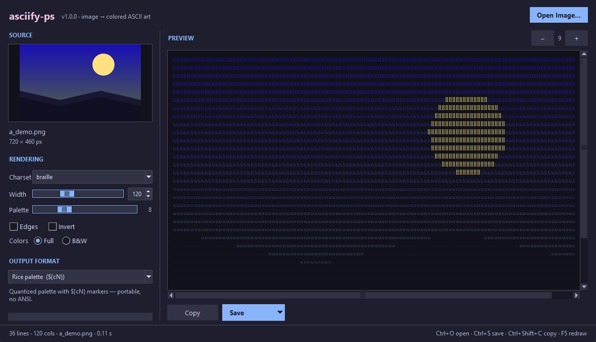

<p align="center">
  
</p>

<h1 align="center">asciify-ps</h1>

<p align="center">
  <em>Turn images into colored ASCII art — with a live preview.</em>
</p>

---

## What it is

**asciify-ps** is a small Windows desktop app that converts images into colored
ASCII art. Pick an image, drag the width slider, and the artwork re-renders as you
go: switch charset, palette size, colour mode, edge detection or inversion and the
preview updates in place. When you like what you see, copy it or save it.

It is a Tkinter front-end for the [`asciify-them`](https://github.com/ndrscalia/asciify-them)
rendering library, which is vendored in this repository so the app runs with no
install step beyond its Python packages.

## Features

- **Live preview** — the output re-renders automatically (~300 ms debounce) as you change any setting.
- **Drag & drop** — drop an image anywhere on the window, or straight onto `asciify-ps.exe`.
- **Width control** — 20–300 columns, via slider or typed value.
- **Charset presets** — `default`, `classic`, `extended`, `braille`, `unicode_blocks`.
- **Colour and black & white** rendering, with optional **edge detection** and **inversion**.
- **Four output formats**, including a portable palette format and a classic-ANSI mode for old terminals.
- **Export** — copy to clipboard, or save as `.txt`, `.ps1` (PowerShell) or `.cmd`.
- **Preview zoom** — text size 6–22 pt, via the toolbar or `Ctrl` + mouse wheel.
- Dark theme, high-DPI friendly, no console window.

## Getting it running

### Option A — the standalone executable (no Python needed)

1. Download **`asciify-ps.exe`** from the [Releases](../../releases) page.
2. Double-click it.
3. Drag an image onto the window — or onto the `.exe` icon itself.

Nothing to install: the interpreter, the rendering library and OpenCV are all
bundled inside the single file.

### Option B — from source

Requires **Python 3.9+** (the official Windows installer already includes `tkinter`).

```bash
git clone https://github.com/Zenolitee/asciify-ps.git
cd asciify-ps
pip install -r requirements.txt
python asciify_ps.py
```

On Windows you can also just double-click **`asciify-ps.bat`**, which launches the
app from its own folder. You can pass an image straight away:

```bash
python asciify_ps.py path\to\image.jpg
```

## Usage

1. Click **Open Image…**, drag an image in, or drop a file onto the executable.
   Supported: `.png`, `.jpg`, `.jpeg`, `.bmp`, `.webp`, `.gif`, `.tif`, `.tiff`.
2. Adjust the controls on the left. The preview refreshes on its own:
   - **Charset** — the character ramp; `braille` gives the smoothest gradients.
   - **Width** — output width in columns; height follows the aspect ratio.
   - **Palette** — number of colours used by the Rice format (2–24), picked from the image itself.
   - **Edges** — overlay contours for a line-art look.
   - **Invert** — flip light and dark.
   - **Colors** — full colour or black & white.
   - **Output format** — see the table below.
3. Use **Copy** or **Save** to get the result out. The status bar shows the rendered
   size and how long the conversion took.

### Output formats

| Format | What it produces |
| --- | --- |
| **Rice palette `${cN}`** | A `(palette c1=R,G,B …)` header plus inline `${cN}` colour markers, using 2–24 colours quantized from the image. Portable — no ANSI escapes. |
| **True color** | Raw 24-bit ANSI. Needs a modern true-colour terminal. |
| **16 colors** | Classic ANSI palette, for `cmd.exe`, `conhost` and older terminals. |
| **Plain text** | All styling removed — monochrome text. |

### Keyboard shortcuts

| Shortcut | Action |
| --- | --- |
| `Ctrl+O` | Open an image |
| `Ctrl+S` | Save as `.txt` |
| `Ctrl+Shift+C` | Copy the result |
| `F5` | Re-render |
| `Ctrl` `+` / `Ctrl` `-` | Zoom the preview |
| `Ctrl+0` | Reset the zoom |
| `Ctrl` + mouse wheel | Zoom the preview |

## Building the executable yourself

```bat
build-exe.bat
```

This installs PyInstaller and runs `asciify-ps.spec`, producing a single
`dist\asciify-ps.exe` with the app icon embedded and no console window. The spec
bundles the vendored library, the icon and the `tkdnd` extension used for
drag & drop.

## Project layout

```
asciify_ps.py         the Tkinter application
asciify-ps.bat        double-click launcher for a source checkout
asciify-ps.spec       PyInstaller build recipe
build-exe.bat         one-click executable build
bring_front.ps1       optional helper: brings a Python app window to the foreground
requirements.txt      runtime dependencies
assets/icon.ico       application icon (window + executable)
docs/screenshot.png   screenshot used above
asciify-them/         vendored rendering library (MIT) — see its LICENSE
  ├── LICENSE
  ├── requirements.txt
  └── src/asciify/    core, process, renderer, utils, cli
```

## Credits

The ASCII rendering engine is **[asciify-them](https://github.com/ndrscalia/asciify-them)**
by **Andrea Scalia**, redistributed here under its MIT license. It is itself
partially based on **[ascii-view](https://github.com/gouwsxander/ascii-view)** by
Xander Gouws. The vendored copy is included for convenience; its original
`LICENSE` is kept at `asciify-them/LICENSE`.

Drag & drop is provided by [tkinterdnd2](https://github.com/pmgagne/tkinterdnd2).

## License

The application code in this repository is released under the **MIT License** —
see [LICENSE](LICENSE). The vendored `asciify-them` library remains under its own
MIT license, reproduced at `asciify-them/LICENSE`.
